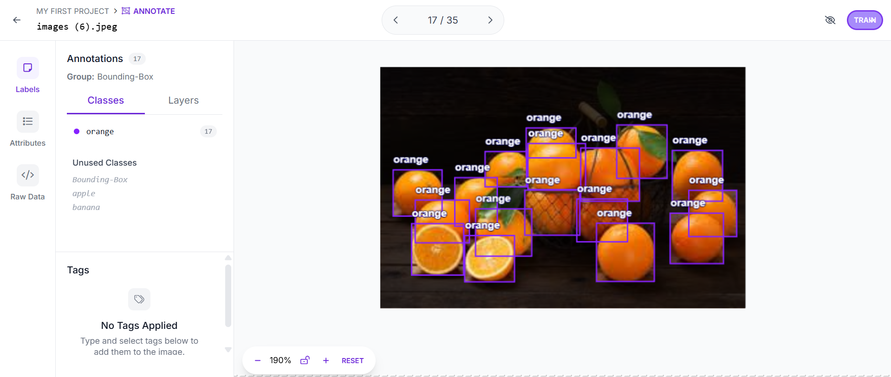

# 🍎🍌🍊 Multi-Class Fruit Detection Dataset (YOLOv5)

This dataset is created to detect three types of fruits using **YOLOv5 Object Detection**:

- 🍎 Apple — 15 images  
- 🍌 Banana — 15 images  
- 🍊 Orange — 20 images  

All images have been labeled with bounding boxes using **Roboflow** and exported to **YOLOv5 PyTorch** format.  
The dataset is split into **train**, **valid**, and **test** sets.

---

## 📂 Dataset Structure
```
fruit_dataset_yolov5/
│── data.yaml               # YOLOv5 configuration (class count, class names, paths)
│── train/
│   ├── images/              # Training images
│   └── labels/              # YOLOv5 labels (.txt)
│── valid/
│   ├── images/
│   └── labels/
│── test/
│   ├── images/
│   └── labels/
│── README.dataset.txt
│── README.roboflow.txt
```
---

## 🛠 Tools Used
- [Roboflow](https://roboflow.com/) — Image labeling & augmentation  
- [YOLOv5](https://github.com/ultralytics/yolov5) — Object Detection Model  
- Python & PyTorch — Model training

---

## 📸 Labeling Screenshot
  
*(Replace with your labeling process screenshot from Roboflow)*

---

## 📜 License
This dataset is created for educational and research purposes. Free to use with attribution.
